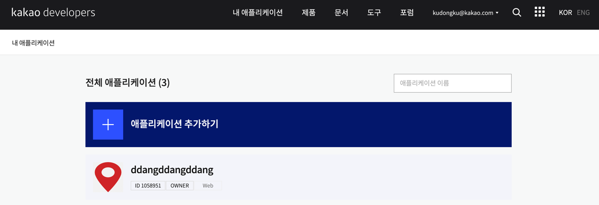
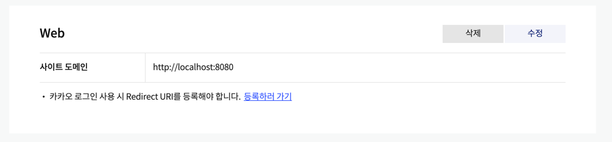
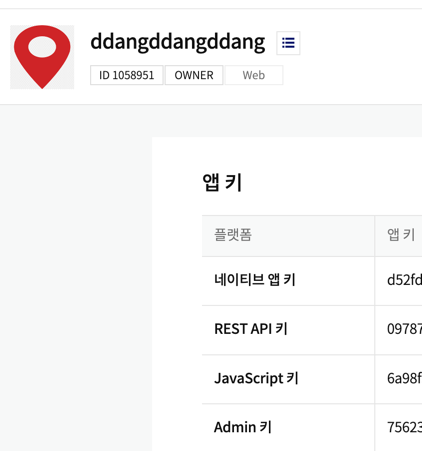
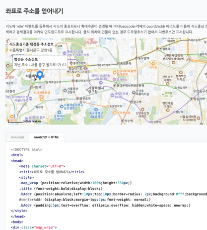

# 1. application 생성하기

# 2. 플래폼 지정하기

# 3. 앱 키 받아오기

# 4. html 파일 긁어오기


> https://apis.map.kakao.com/web/sample/coord2addr/

- 사이트에서 html + javascript 글을 긁어옵니다.

# 5. js 커스텀하기
```javascript
  // 지도를 클릭했을 때 클릭 위치 좌표에 대한 주소정보를 표시하도록 이벤트를 등록합니다
  kakao.maps.event.addListener(map, 'click', function(mouseEvent) {
    searchDetailAddrFromCoords(mouseEvent.latLng, function(result, status) {
      if (status === kakao.maps.services.Status.OK) {

        var detailAddr = !!result[0].road_address ? '<div>도로명주소 : ' + result[0].road_address.address_name + '</div>' : '';
        detailAddr += '<div>지번 주소 : ' + result[0].address.address_name + '</div>';

        address = result[0].address.address_name.split(" ")[0]+" "+result[0].address.address_name.split(" ")[1]+" "+result[0].address.address_name.split(" ")[2];

        var content = '<div class="bAddr">' +
            '<span class="title">법정동 주소정보</span>' +
            detailAddr +
            '</div>';

        // 마커를 클릭한 위치에 표시합니다
        marker.setPosition(mouseEvent.latLng);
        marker.setMap(map);

        // 인포윈도우에 클릭한 위치에 대한 법정동 상세 주소정보를 표시합니다
        infowindow.setContent(content);
        infowindow.open(map, marker);

      }
    });
  });
```
```
address = result[0].address.address_name.split(" ")[0]+" "
+result[0].address.address_name.split(" ")[1]+" "
+result[0].address.address_name.split(" ")[2];
```
이 부분으로 주소값을 받아올 수 있습니다.

```javascript
function sendAddress(){
    alert(address);

    const data = {
      "address" : address
    }

    $.ajax({
      type: 'POST',
      url: '/kakao/api/address',
      contentType: 'application/json',
      data: JSON.stringify(data),
      success: function () {
        alert("성공");
      }
    });
  }
```

이 부분으로 주소값을 MAP 형태?로 구현한 후 post 방식으로 보낼 수 있습니다.

# 6. 컨트롤러에서 받기
```java
@RestController
public class KakaoApiController {

  @PostMapping("/kakao/api/address")
  public void getAddress(@RequestBody addressDto address){
    System.out.println(address.getAddress());
  }
}
```